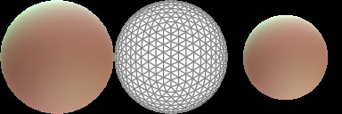

# SHLight_pytorch
Add spherical harmonic lights to pytorch3D

# Generate random lights
```bash
python generate_random_sphere.py
```

# Use the light from Basel Illumination Prior
```bash
python render_bip2017.py 39674
```



or
1. download data from the [official website](https://gravis.dmi.unibas.ch/PMM/data/bip/)
2. push the `data` folder under `resources` and rename it to `BIP2017`
```bash
python render_bip2017.py ID_OF_THE_FILE
```
